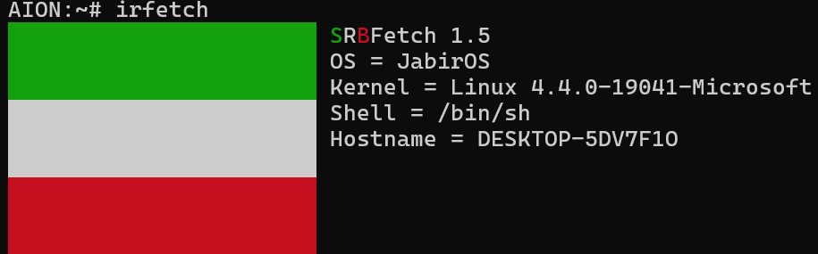

# irefetch
Iranized fork of srbfetch; Fast, C-Written, non-bloated alternative for neofetch and fastfetch. Work in progress!

## Installation guide
Run vars.sh script.
```
sh vars.sh
```
Compile irfetch.c
```
clang irfetch.c -o srbfetch
```
Copy the binary to $PATH
```
cp irfetch /usr/bin
```
## Run irfetch
```
irfetch
```
